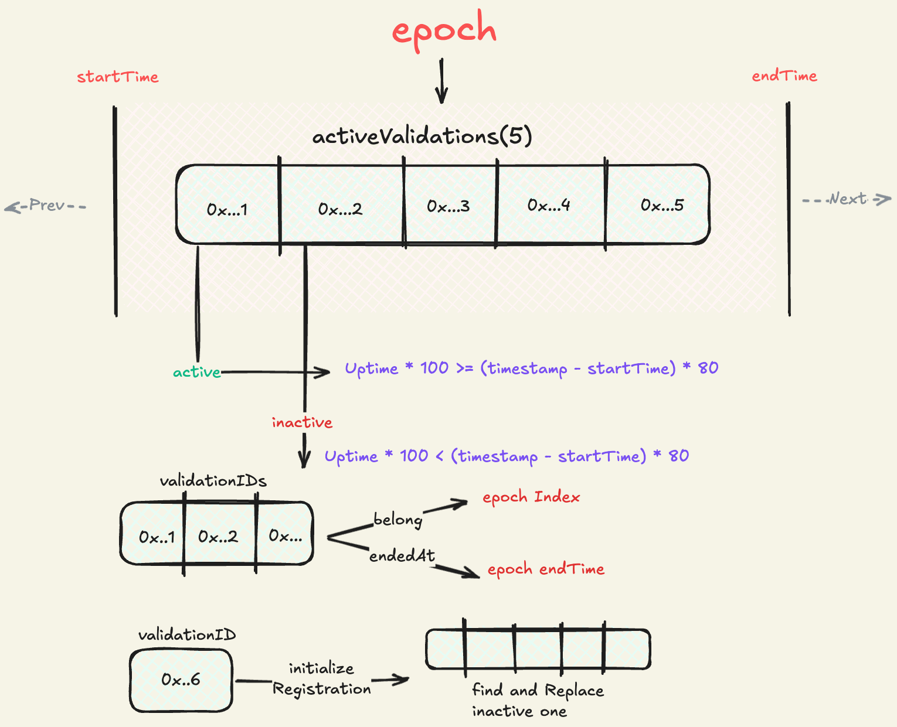
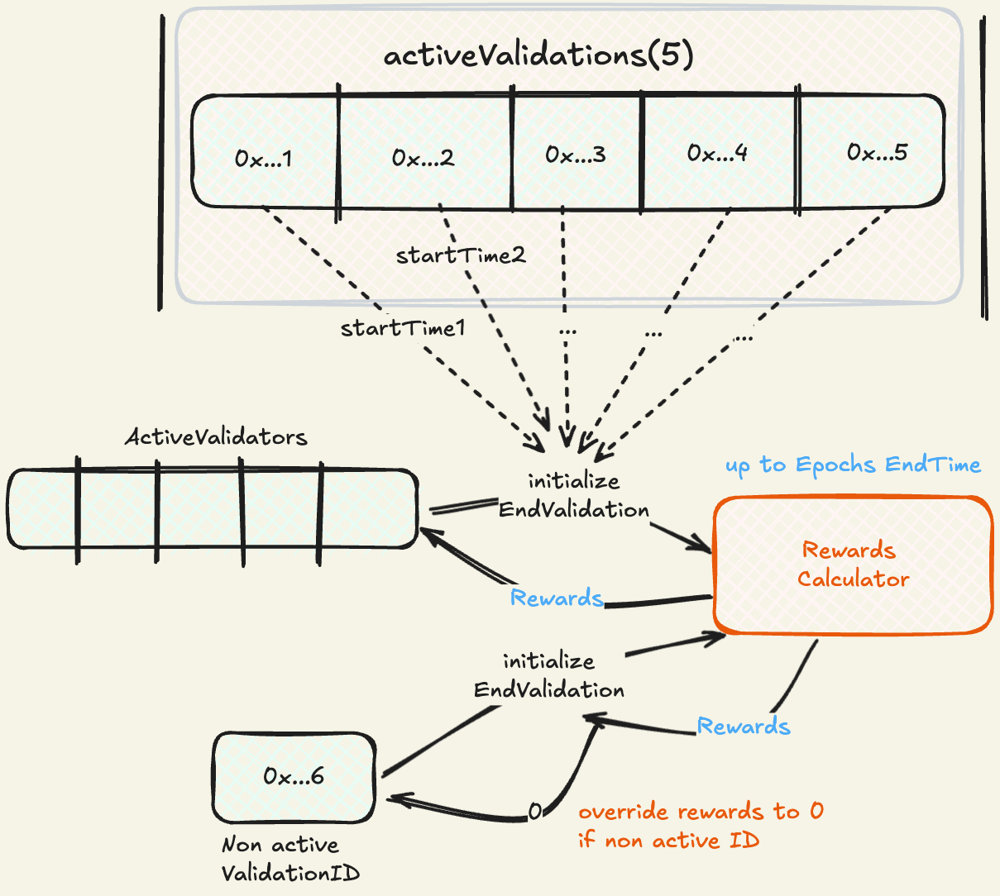
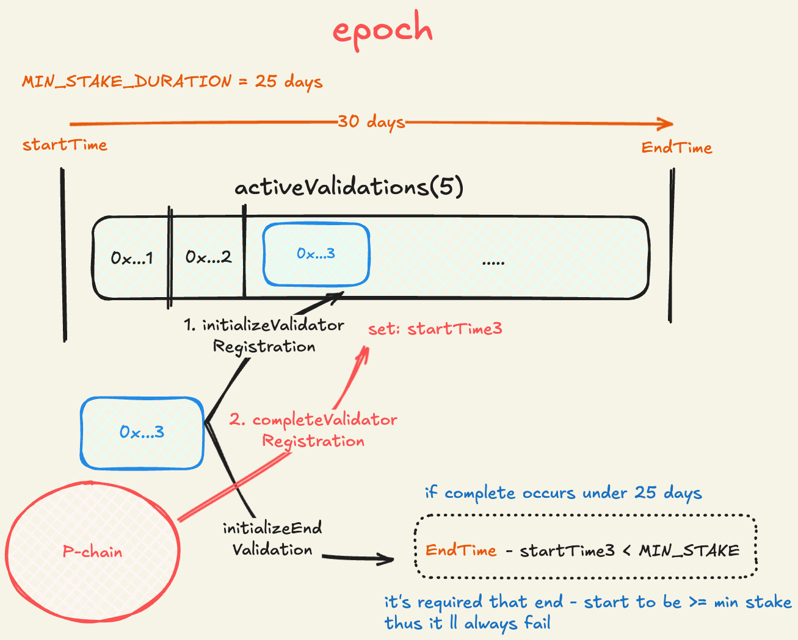

# Validation Epochs (cycles)

**Mechanism**:

- Epochs are created on validator registration process if the prev epoch ended, it ll start at registration `timestamp` for 30 days

- epochs maintain an array of active validators (5), Active validators have to submit periodically their `uptime proof` to be part of the active ones while satisfying an `UPTIME_THRESHOLD` of activity (80/100 of total time), validators not satisfying that condition can be replaced by another through (registration process).

- Registered validators will belong to an Epoch and will always end at its epochs' endTime

- Validators cannot register validations for `consecutive epochs`.

    

**Rewards**:

- No Tier implementation, it's a linear calculation based on basis points per year for every validator currently.
- Validators will accrue rewards for the duration of its activity `(endTime - startTime)` up to its epoch's duration (30 days).
- Validations that ended up out of active list (5), won't earn any rewards `(0)`.

    

**Caveats**:

- Validations acknowledged by P-chain (`completeValidationRegistration`) under MIN_STAKE_DURATION won't neither be able to end Validation nor claim rewards.

    

**Considerations**:

- cannot set MIN_STAKE_DURATION to 30 days or `equal` to epoch's duration, because of:
  - validations end at epochs' `endTime`.
  - validations start at different points in time from epoch's `startTime`
  - Therefore, validation duration could not be ever satisfy MIN_STAKE_DURATION
- should set `MIN_STAKE_DURATION < Epoch duration` which enables a gap of epoch's `endTime` - `MIN_STAKE_DURATION` for registrations or replacement of inactive validators
- replacement of inactive validators should occur within `GAP` time. otherwise they ll run into caveats.
- validators should consider their validation `duration` on `initializeValidatorRegistration` between `MIN_STAKE_DURATION` end epochs's `endTime`.
- `initializeEndValidation` should be called by validationID owners.

**Example**:

- `MIN_STAKE_DURATION`: 20 days
- `EPOCH_DURATION`: 30 days
- it gives a `GAP` of 10 days for attempting registrations so that replacing inactive validationIDs.

**Tests**:

- testRewardsToActiveValidatorsUpToEpochEndTime
- testRemovesRewardsOfInactiveValidators
- testCreatesNewEpochUponEpochEnding
- testCannotRegisterIfAllsValidationsAreActive
- testInvalidatesAndReplacesAnInactiveValidationID //fix
- testCanRegisterUpToMaxValidatorPerEpoch
- testCanRegisterOneValidationPerValidatorEveryTwoEpochs
